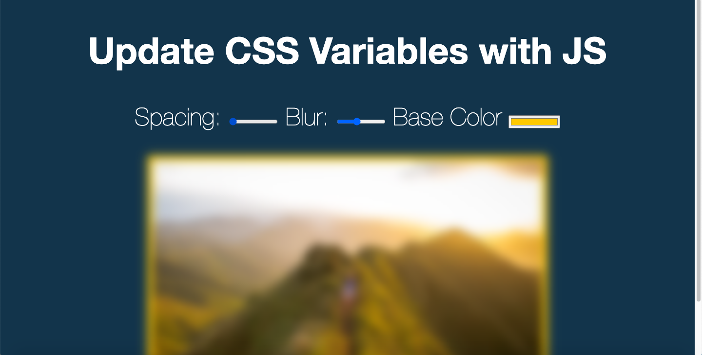

# CSS-Variables-and-JS

## Description

This app was challenge three from [Wes Bos](https://javascript30.com/) which uses HTML, CSS variables, and vanilla JS.

## Installation

1. Clone the repo
2. Right click the index.html file and open in browser

## Usage

[Deployed Site](https://sharonkim09.github.io/CSS-JS-Clock/)

## Credit

Credits to [Wes Bos](https://github.com/wesbos) JS 30Day Challenge

